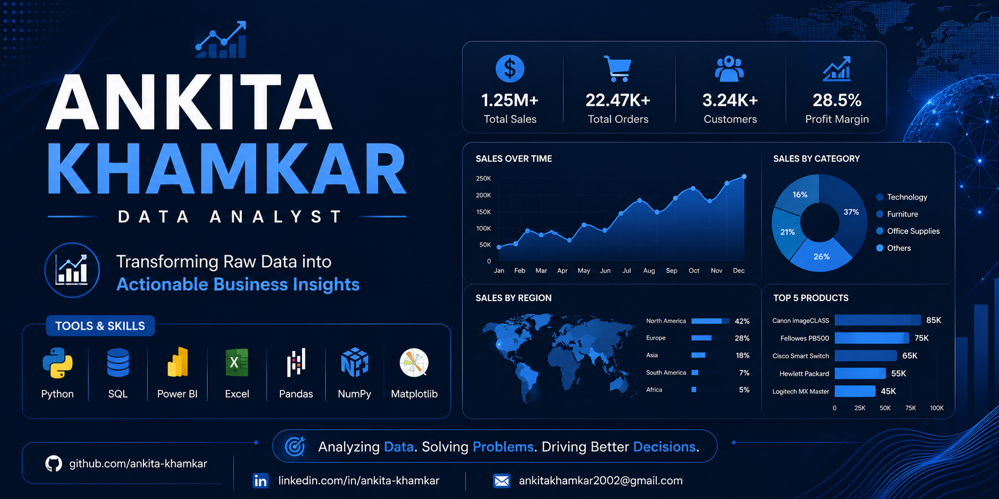
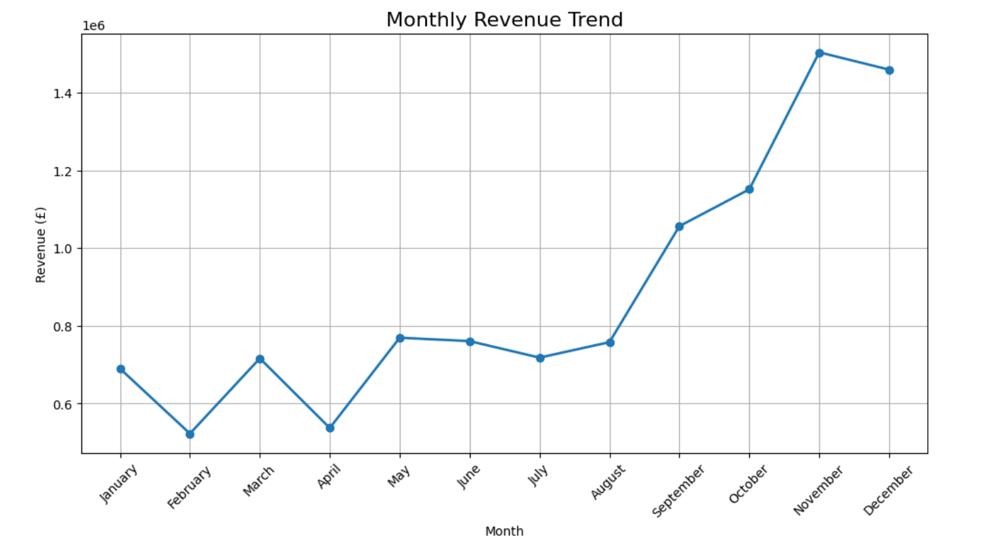
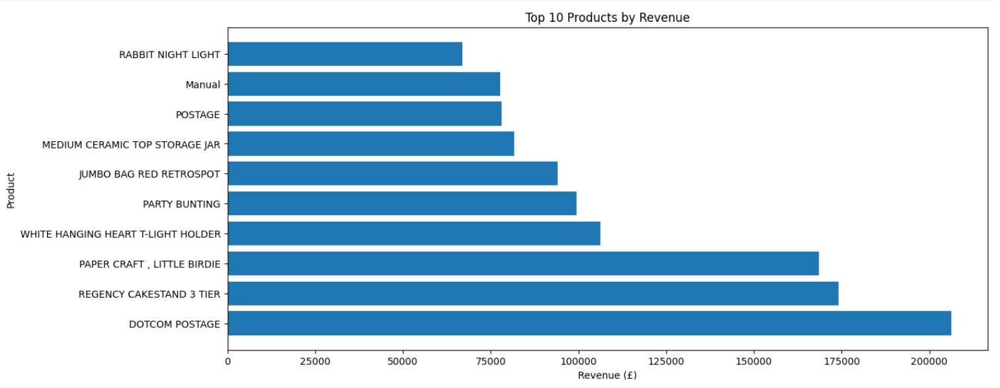
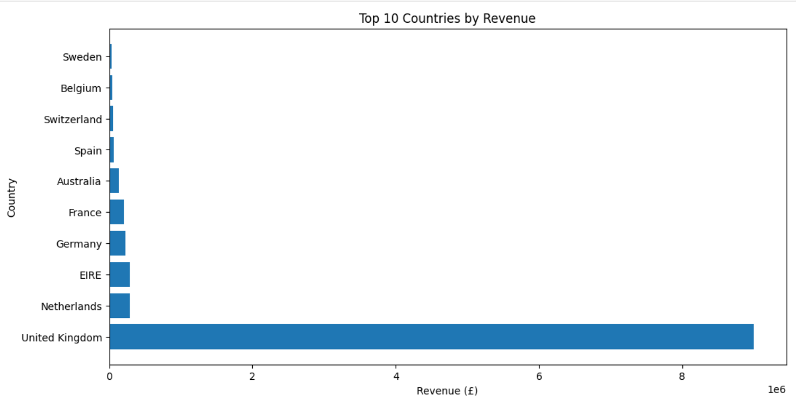
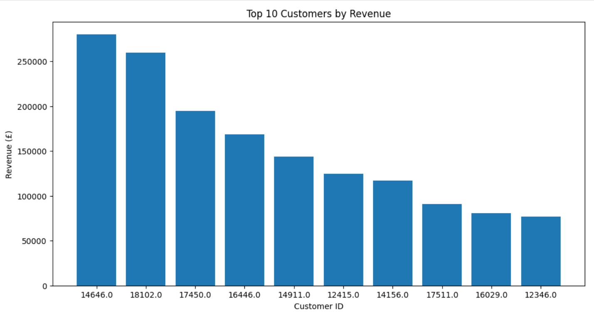
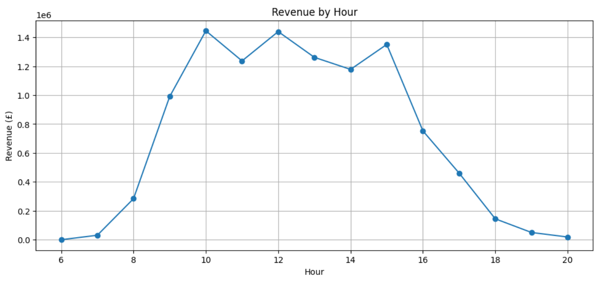

<p align="center">
  
</p>

# 📊 Retail Sales Performance Analysis Using Python


---

## 📌 Project Overview

This project analyzes over **541,000 retail transactions** from a UK-based online retail store to uncover valuable business insights related to sales performance, customer purchasing behavior, product trends, and revenue distribution.

The project follows a complete **Data Analytics workflow**, including data cleaning, feature engineering, exploratory data analysis (EDA), visualization, and business recommendations using Python.

---

## 🎯 Business Objective

The objective of this project is to:

- Analyze overall business performance.
- Identify sales trends over time.
- Discover top-performing products and customers.
- Evaluate customer purchasing behavior.
- Analyze country-wise revenue.
- Generate actionable business insights for decision-making.

---

## 📂 Dataset Information

- **Dataset:** Online Retail Dataset
- **Source:** UCI Machine Learning Repository
- **Time Period:** December 2010 – December 2011
- **Total Records:** 541,909
- **Total Features:** 8

### Dataset Columns

| Column | Description |
|---------|-------------|
| InvoiceNo | Invoice Number |
| StockCode | Product Code |
| Description | Product Description |
| Quantity | Quantity Purchased |
| InvoiceDate | Transaction Date & Time |
| UnitPrice | Product Price |
| CustomerID | Customer Identifier |
| Country | Customer Country |

---

# 🛠️ Technologies Used

- Python
- Pandas
- NumPy
- Matplotlib
- Plotly
- SciPy
- OpenPyXL
- Jupyter Notebook

---

# 📚 Python Libraries

```python
import pandas as pd
import numpy as np

import matplotlib.pyplot as plt

import plotly.express as px
import plotly.graph_objects as go

from scipy import stats

import warnings
warnings.filterwarnings("ignore")
```

---

# 📋 Project Workflow

## ✅ Phase 1 : Data Import & Understanding

- Imported required libraries
- Loaded dataset
- Dataset overview
- Checked data types
- Dataset statistics
- Initial exploration

---

## ✅ Phase 2 : Data Cleaning

- Removed duplicate records
- Checked missing values
- Removed cancelled orders
- Removed invalid quantities
- Removed zero-priced products
- Prepared clean dataset

---

## ✅ Phase 3 : Feature Engineering

Created new business features:

- Total Sales
- Year
- Month
- Month Name
- Day
- Day Name
- Hour
- Quarter
- Weekday

---

## ✅ Phase 4 : Exploratory Data Analysis (EDA)

Calculated important KPIs:

- Total Revenue
- Total Orders
- Total Customers
- Total Products
- Total Quantity Sold
- Average Order Value
- Average Product Price
- Countries Served

---

## ✅ Phase 5 : Data Visualization

Created professional visualizations including:

- Monthly Revenue Trend
- Monthly Sales Analysis
- Quarterly Revenue
- Top 10 Countries
- Top 10 Customers
- Top 10 Products
- Hourly Sales Trend
- Orders by Weekday
- Revenue Distribution
- Quantity Distribution
- Unit Price Distribution
- Interactive Plotly Charts

---

## ✅ Phase 6 : Business Insights

Generated business insights including:

- Overall sales performance
- Revenue by country
- Top-selling products
- High-value customers
- Monthly sales trend
- Quarterly business performance
- Customer purchasing behavior
- Peak shopping hours
- Revenue distribution
- Product performance

---

# 📈 Key KPIs

- 💰 Total Revenue
- 🛒 Total Orders
- 👥 Total Customers
- 📦 Total Products
- 🌍 Countries Served
- 📈 Average Order Value
- 💷 Average Product Price

---

# 💡 Business Recommendations

- Increase marketing efforts in high-performing countries.
- Maintain inventory for best-selling products.
- Launch customer loyalty programs.
- Improve seasonal inventory planning.
- Introduce promotional campaigns during low-sales periods.
- Focus on customer retention strategies.
- Optimize staffing during peak shopping hours.
- Expand successful product categories.

---

# 📸 Project Screenshots

## Dashboard / Visualizations

### Monthly Revenue Trend



---

### Top 10 Products



---

### Country-wise Revenue



---

### Customer Analysis



---

### Hourly Sales Trend



---

# 📁 Project Structure

```
Retail-Sales-Performance-Analysis
│
├── Data
│   └── Online Retail.xlsx
│
├── Notebook
│   └── Retail_Sales_Performance_Analysis.ipynb
│
├── Images
│   ├── monthly_sales.png
│   ├── country_sales.png
│   ├── top_products.png
│   ├── customer_analysis.png
│   └── hourly_sales.png
│
├── README.md
├── requirements.txt
└── LICENSE
```

---

# 🎯 Skills Demonstrated

- Data Cleaning
- Data Wrangling
- Exploratory Data Analysis
- Feature Engineering
- Business Intelligence
- Data Visualization
- Statistical Analysis
- Business Insight Generation
- Python Programming
- Analytical Thinking

---

# 🚀 Future Improvements

- Customer Segmentation (RFM Analysis)
- Sales Forecasting
- Interactive Dashboard using Streamlit
- Machine Learning for Customer Purchase Prediction
- Product Recommendation System

---

# 📬 Connect With Me

**Ankita Khamkar**

- 💼 LinkedIn: https://www.linkedin.com/in/ankita-khamkar-1b64701b4?utm_source=share&utm_campaign=share_via&utm_content=profile&utm_medium=android_app 
- 💻 GitHub: https://github.com/ankita-khamkar 

---

## ⭐ If you found this project useful, please consider giving it a star!
